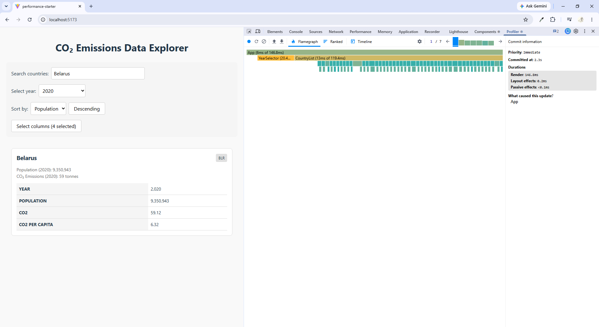
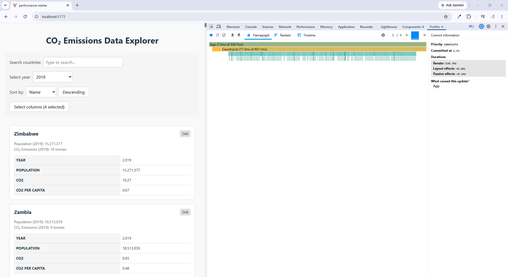

# Performance Report

## Baseline (Before Optimization)

### Interactions

| Interaction | Render (ms) | Caused by |
|---|---|---|
| Search (Belarus) | 146.8ms | App |
| Year change (2019) | 713.5ms | App |
| Sort (Name Desc) | 530.7ms | App |
| Toggle columns | 492.3ms | App |

### Screenshots

#### Search

#### Year change

#### Sort

#### Toggle columns

### Observations
- All updates caused by App component re-rendering entire tree
- Year change is the slowest interaction (713.5ms)
- No memoization — all components re-render on every state change
- `key={index}` used instead of stable keys
- Heavy calculations (filter, sort, createYearDataMap) run on every render

### Summary

- **Total render time across all interactions:** ~1883ms
- **Average render time:** ~471ms
- **Main bottleneck:** CountryList renders all countries on every state change without any memoization