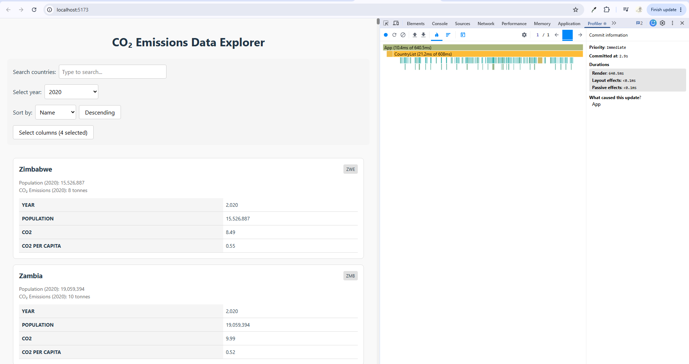
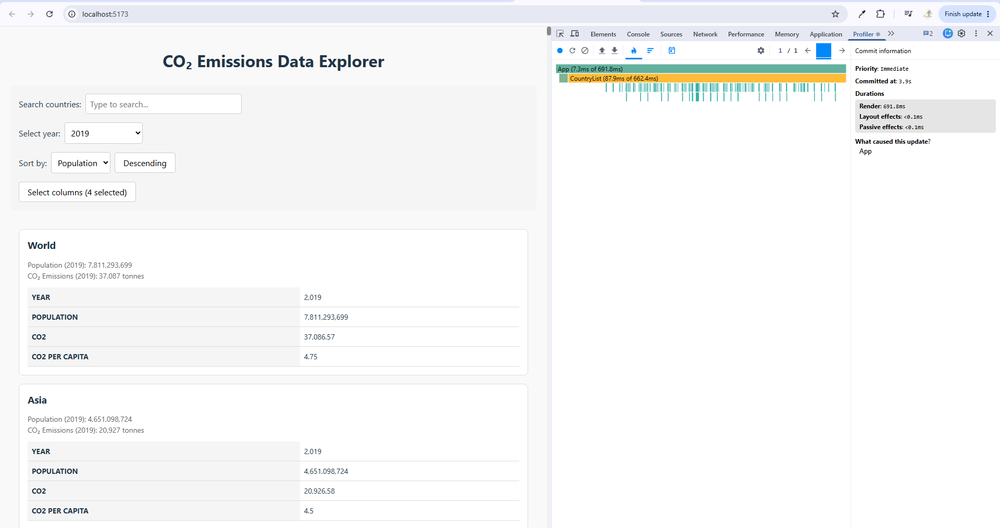
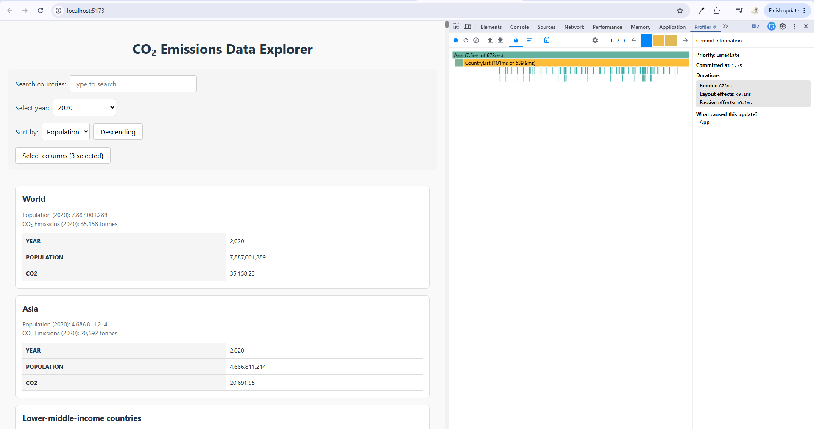
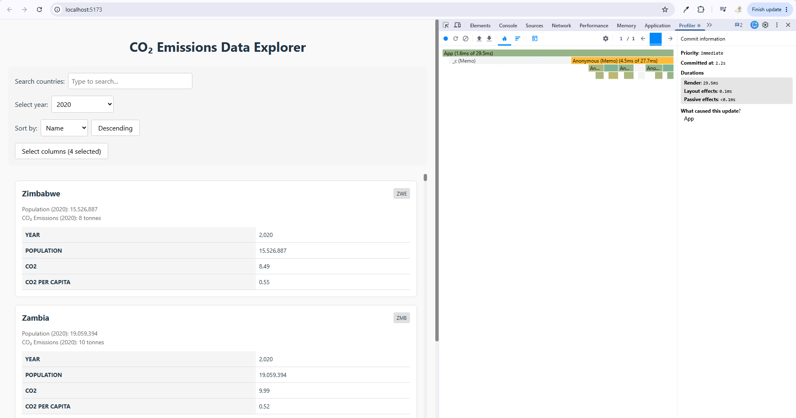
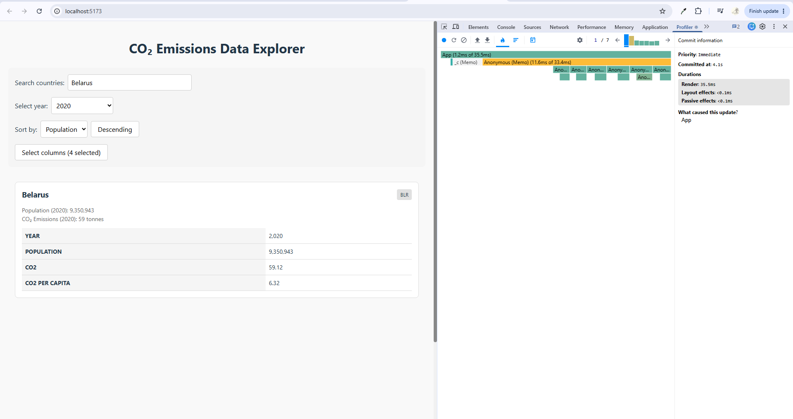
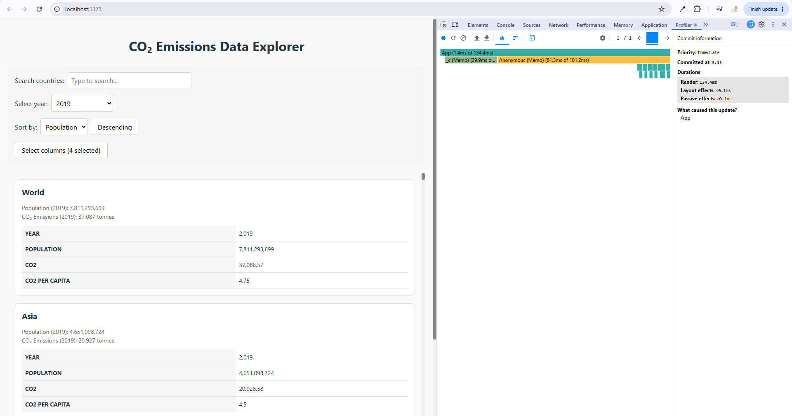
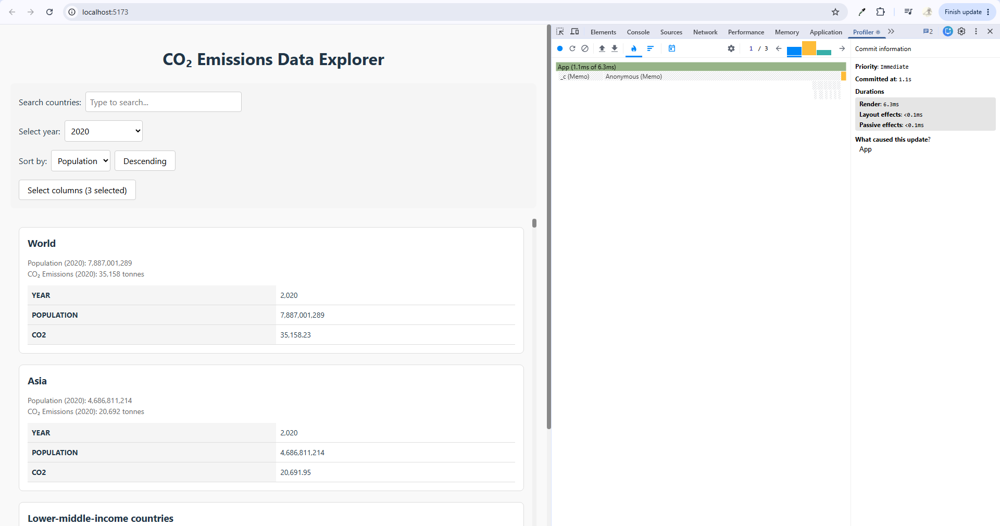

# Performance Optimization Report

## Baseline Measurements

### Interaction A: Sort countries
- **Commit duration**: N/A
- **Render duration**: 640.5 ms
- **Screenshot**: 

### Interaction B: Search countries
- **Commit duration**: N/A
- **Render duration**: 160.3 ms
- **Screenshot**: 

### Interaction C: Change year
- **Commit duration**: N/A
- **Render duration**: 691.8 ms
- **Screenshot**: 

### Interaction D: Toggle column
- **Commit duration**: N/A
- **Render duration**: 673 ms
- **Screenshot**: 

## Optimized Measurements

### Interaction A: Sort countries
- **Commit duration**: N/A
- **Render duration**: 29.5 ms
- **Screenshot**: 

### Interaction B: Search countries
- **Commit duration**: N/A
- **Render duration**: 35.5 ms
- **Screenshot**: 

### Interaction C: Change year
- **Commit duration**: N/A
- **Render duration**: 134.4 ms
- **Screenshot**: 

### Interaction D: Toggle column
- **Commit duration**: N/A
- **Render duration**: 6.3 ms
- **Screenshot**: 

## Summary of Improvements

| Interaction      | Baseline (ms) | Optimized (ms) | Improvement |
| ---------------- |---------------|----------------|-------------|
| Sort countries   | 640.5         | 29.5           | 95.4 %      |
| Search countries | 160.3         | 35.5           | 77.9 %      |
| Change year      | 691.8         | 134.4          | 80.6 %      |
| Toggle column    | 673           | 6.3            | 99.1 %      |
| **Average**      | **541.4 ms**  | **51.4 ms**    | **90.5 %**  |